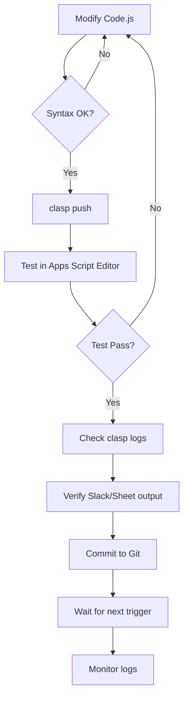

# Google Apps Script Deployment Checklist

> **Critical**: This checklist prevents deploying old code to production triggers.

## 📋 Pre-Deployment Checklist

Before any code change is considered "done":

### 1. Code Changes ✅
- [ ] Modified `Code.js` with required changes
- [ ] Updated version number in code comments (if applicable)
- [ ] Tested locally (syntax check, logic review)

### 2. Deploy to GAS 🚀
```bash
cd backend/gas
clasp push
```

**⚠️ BLOCKING**: Code changes are NOT live until `clasp push` is executed.

### 3. Test in Apps Script Editor 🧪
- [ ] Open Apps Script Editor: https://script.google.com/home/projects/1Uu7UG3oLNkX_cFI54eeYrjqp1oN5gj-FJ36kMvT37AJGL1eNCCU0Oi48
- [ ] Run test function:
  - `testWeeklyReport()` - for weekly report changes
  - `testTaiwanRankTracker()` - for Taiwan rank tracker changes
  - `testGetStatistics()` - for statistics API changes
  - `testGetUpcomingEvents()` - for events API changes
- [ ] Check execution logs for success messages

### 4. Verify Logs 📊
```bash
cd backend/gas
clasp logs | head -30
```

Check for:
- [ ] No error messages
- [ ] Expected log outputs (e.g., "✅ Logged 10 countries to GlobalTop10History")
- [ ] Function completed successfully

---

## 🔍 Post-Deployment Verification

### For Slack Notifications
- [ ] Check Slack channel for test notification
- [ ] Verify message format is correct
- [ ] Confirm all expected data is present (links, statistics, etc.)

### For API Changes
- [ ] Test API endpoint with curl or browser:
  ```bash
  curl "https://script.google.com/macros/s/AKfycbwshk7w0519zj1iaePXvnLz0GOz8TvQCERe9HMr2sCQ/exec?action=getStats"
  ```
- [ ] Verify JSON response structure
- [ ] Check frontend integration (if applicable)

### For Taiwan Rank Tracker
- [ ] Check `GlobalTop10History` sheet for new data
- [ ] Verify Slack message includes Google Sheet link
- [ ] Confirm Taiwan rank is calculated correctly

---

## 🤖 Automatic Trigger Verification

### Check Trigger Status
1. Open Apps Script Editor → **Triggers** (clock icon)
2. Verify active triggers:

| Function | Trigger Type | Schedule | Status |
|----------|-------------|----------|--------|
| `sendWeeklyReport` | Time-driven | Weekly (Tuesday 9-10 AM) | ✅ Active |
| `trackTaiwanRank` | Time-driven | Daily (8-9 AM) | ✅ Active |

### Monitor Next Execution
```bash
# Check logs after next trigger time
clasp logs | grep "Successfully\|Error" | head -20
```

---

## 🚨 Common Issues & Solutions

### Issue: Old code still running after `clasp push`
**Solution**:
1. Verify push completed: `clasp push` should show "Pushed 2 files"
2. Check timestamp: `stat -f "%Sm" -t "%Y-%m-%d %H:%M:%S" Code.js`
3. Re-run test function in Apps Script Editor
4. Wait for next trigger execution (code is cached)

### Issue: `clasp run` permission errors
**Expected behavior** - Per CLAUDE.md:
- `clasp run` cannot execute functions using `UrlFetchApp`, `SpreadsheetApp`, `MailApp`
- **Always test in Apps Script Editor**, not via CLI

### Issue: Trigger not executing
**Debugging steps**:
1. Check `clasp logs` for execution records
2. Verify trigger exists in Apps Script Editor
3. Check trigger quota limits (Apps Script → Project Settings)
4. Look for error emails from Google Apps Script

---

## 📝 Quick Reference Commands

```bash
# Navigate to GAS directory
cd backend/gas

# Deploy code
clasp push

# View recent logs
clasp logs | head -30

# Search logs for specific function
clasp logs | grep "trackTaiwanRank"

# Check file modification time
stat -f "%Sm" -t "%Y-%m-%d %H:%M:%S" Code.js
```

---

## 🔄 Recommended Workflow



---

## 🎯 Pre-Commit Git Hook (Optional)

Add this reminder to `.git/hooks/pre-commit`:

```bash
#!/bin/bash
if git diff --cached --name-only | grep -q "backend/gas/Code.js"; then
    echo "⚠️  WARNING: You modified backend/gas/Code.js"
    echo "   Remember to run: cd backend/gas && clasp push"
    echo ""
    read -p "Did you run 'clasp push'? (y/n) " -n 1 -r
    echo
    if [[ ! $REPLY =~ ^[Yy]$ ]]; then
        echo "❌ Commit aborted. Run 'clasp push' first."
        exit 1
    fi
fi
```

---

## 📅 Maintenance Schedule

- **Weekly**: Check trigger execution logs after weekly report
- **Monthly**: Review trigger quota usage in GCP Console
- **After major updates**: Run all test functions and verify outputs

---

*Last Updated: 2026-02-05*
*Maintainer: Hour of AI Team*
